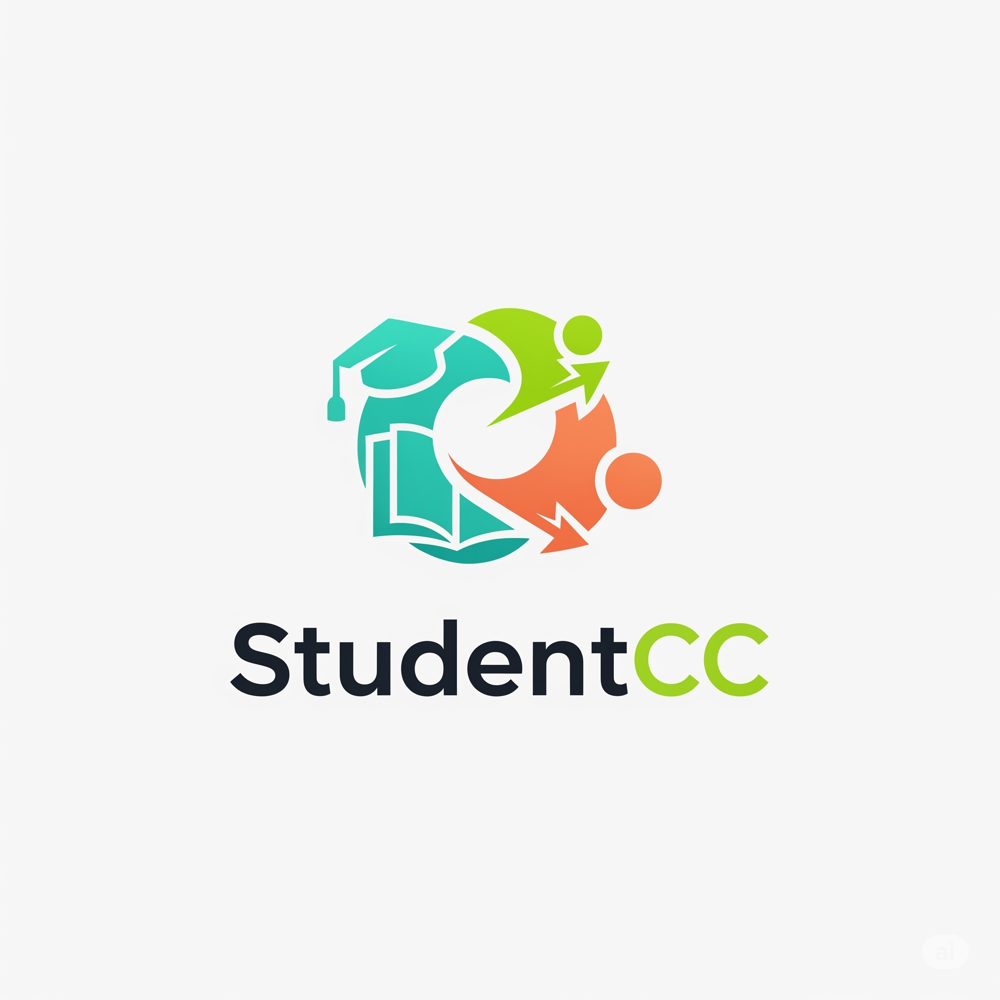

# StudentCC - VIT Student Companion App 🎓

<div align="center">
  
  <h3>🚀 The Ultimate Academic Companion for VIT Students</h3>
  <p><strong>Version 1.4.0</strong> - The Biggest Update Yet!</p>
</div>

## 📱 **For Students - Download the App**

🔥 **[Download StudentCC v1.4.0](https://salmanmalvasi.github.io/studentcc-landing.html)**

Join 3000+ VIT students already using StudentCC for:
- 📊 Real-time attendance tracking
- 🎯 Smart GPA calculations  
- 📅 Class schedules & notifications
- 🏆 Performance analytics
- 🎮 Hidden mini-games & more!

---

## 👨‍💻 **For Developers - Technical Documentation**

> **Note:** This repository is for developers and contributors. Students should download the app from the link above.

### 🆕 **What's New in v1.4.0**

#### **User-Facing Features:**
1️⃣ **Detailed Attendance View** – See your attendance day-by-day with enhanced parsing logic  
2️⃣ **Enhanced Marks Section** – Track class averages & performance trends  
3️⃣ **Smart OD Calculator** – Know exactly how many On Duty classes you've used and left  
4️⃣ **🎮 Mystery Game** – Hidden inside the app for entertainment  
5️⃣ **⚡ Faster Sync** – Quicker & smoother data updates  
6️⃣ **🎨 New Logo + UI** – Smoother experience with modern design  

#### **Technical Improvements:**
🔥 **Firebase In-App Messaging** – Real-time notifications and updates  
🔐 **Enhanced Security** – Secure API key management system  
🏗️ **Better Architecture** – Improved code structure and performance  
🚀 **Auto-Update System** – Seamless updates for users  
📱 **Optimized Build** – Smaller APK size with better performance  

### 🙏 **Acknowledgments & Attribution**

#### **Detailed Attendance Parsing Logic**
Special thanks to **[Arya4930](https://github.com/Arya4930)** for the detailed attendance view parsing logic from:
**[UniCC Repository](https://github.com/Arya4930/UniCC)**

The enhanced attendance parsing implementation in StudentCC v1.4.0 builds upon concepts and logic patterns from the UniCC project. We're grateful for the open-source contribution that helped improve our attendance tracking accuracy.

#### **Collaboration Partners**
- **Unmessify Integration** - Thanks to **Kanishka Chakraborty** and **Teesha Saxena** for hostel mess menu integration
- **VIT Community** - Thanks to all students providing feedback and testing

### 🔧 **Developer Setup**

#### **Prerequisites**
```bash
# Required tools
- Android Studio Arctic Fox or later
- Android SDK API 24+ (Android 7.0+)  
- Java 17 or higher
- Git
```

#### **Secure Setup (Important!)**
```bash
# 1. Clone the repository
git clone https://github.com/Salmanmalvasi/StudentCC.git
cd StudentCC

# 2. Set up environment variables (REQUIRED for security)
cp .env.example .env
# Edit .env with your Firebase configuration

# 3. Generate configuration files
./generate-config.sh

# 4. Build the project
./gradlew build
```

> **🔒 Security Note:** This project uses environment variables for API keys. Never commit `.env` files or `google-services.json` to Git. See `SECURITY.md` for complete setup instructions.

### 🏗️ **Architecture**

#### **Core Technologies**
- **Java** - Primary development language
- **Room Database** - Local data persistence  
- **Firebase** - Analytics, Crashlytics, In-App Messaging
- **Material Design 3** - Modern UI components
- **RxJava** - Reactive programming patterns

#### **Security Features**
- **Environment-based Config** - Secure API key management
- **Encrypted Storage** - Local credential encryption
- **Build-time Validation** - Configuration verification
- **Git History Cleaning** - No exposed secrets

#### **Key Components**
```
app/src/main/java/tk/therealsuji/vtopchennai/
├── activities/          # UI Activities
├── helpers/            # Utility classes & Firebase helpers
├── models/             # Data models
├── interfaces/         # Database DAOs  
├── services/           # Background services
└── fragments/          # UI fragments
```

### 📊 **Database Schema**

#### **Core Tables**
- **Courses** - Course information with venue data
- **Timetable** - Enhanced with detailed attendance parsing
- **Attendance** - Day-by-day tracking with improved accuracy  
- **Marks** - Performance analytics with class averages
- **Exams** - Schedule with venue information

#### **New in v1.4.0**
- Enhanced attendance parsing logic (inspired by UniCC)
- Performance analytics tables
- OD (On Duty) tracking system
- In-app messaging configuration

### 🔐 **Security Implementation**

#### **Environment Variables**
```bash
# Required in .env file
FIREBASE_API_KEY=your_firebase_api_key
FIREBASE_PROJECT_ID=your_project_id  
FIREBASE_PROJECT_NUMBER=your_project_number
FIREBASE_APP_ID=your_app_id
FIREBASE_STORAGE_BUCKET=your_storage_bucket
```

#### **Build Process**
1. **Environment Check** - Validates all required variables
2. **Config Generation** - Creates `google-services.json` from template  
3. **Security Validation** - Ensures no hardcoded secrets
4. **Build & Sign** - Generates optimized release APK

### 🚀 **CI/CD Pipeline**

#### **GitHub Actions Workflow**
- **Automated Builds** - On every push/PR
- **Security Scanning** - Secret detection & validation
- **APK Generation** - Signed release builds  
- **Artifact Upload** - Downloadable APKs

#### **Release Process**
```bash
# 1. Update version in build.gradle
# 2. Test thoroughly
# 3. Create release commit
git commit -m "🚀 Release v1.x.x"

# 4. GitHub Actions automatically builds & uploads APK
```

### 🧪 **Testing**

#### **Firebase In-App Messaging Testing**
```bash
# 1. Add your device as test device in Firebase Console
# 2. Run the app and check logs for device ID
# 3. Create test campaign in Firebase Console
# 4. Use events: app_open, welcome_message, test_in_app_message
```

#### **Local Testing**
```bash
# Debug build
./gradlew assembleDebug

# Run tests  
./gradlew test

# Install on device
./gradlew installDebug
```

### 🤝 **Contributing**

#### **Development Workflow**
1. **Fork** the repository
2. **Create** feature branch: `git checkout -b feature/amazing-feature`
3. **Follow** security guidelines (use `.env` files)
4. **Test** thoroughly with real VIT credentials
5. **Submit** pull request with detailed description

#### **Code Style Guidelines**
- **Java Conventions** - Follow Android best practices
- **Security First** - Never commit secrets or credentials  
- **Comment Complex Logic** - Especially attendance parsing
- **Test Edge Cases** - VIT's systems can be unpredictable

#### **Areas for Contribution**
- 🔍 **Attendance Parsing** - Improve accuracy for different formats
- 📊 **Analytics Features** - New performance insights
- 🎨 **UI/UX Improvements** - Modern design patterns
- 🔐 **Security Enhancements** - Additional protection layers
- 🎮 **Mini-Games** - Fun features for students

### �� **License & Legal**

#### **GNU General Public License (GPL)**
This project is open-source under GPL. Key requirements:
- **Source Available** - Must provide source when distributing
- **Attribution Required** - Credit original authors
- **Copyleft** - Derivative works must also be GPL
- **No Warranty** - Software provided as-is

#### **Third-Party Acknowledgments**
- **UniCC Project** - Attendance parsing logic inspiration
- **Firebase** - Backend services  
- **Material Design** - UI components
- **VIT Chennai** - Educational platform access

### 📞 **Developer Support**

#### **Getting Help**
- 🐛 **Issues** - [GitHub Issues](https://github.com/Salmanmalvasi/StudentCC/issues)
- 📧 **Email** - salmanmalvasi@gmail.com (developers only)
- 📖 **Documentation** - Check `SECURITY.md` for setup
- 💬 **Discussions** - [GitHub Discussions](https://github.com/Salmanmalvasi/StudentCC/discussions)

#### **Bug Reports**
When reporting bugs, include:
- Android version & device model
- StudentCC version  
- Steps to reproduce
- Screenshots/logs (without personal data)
- VIT campus (if relevant)

### 🎯 **Roadmap**

#### **Upcoming Features**
- 🤖 **AI-Powered Predictions** - Grade forecasting
- 📱 **Cross-Platform** - iOS app development  
- 🔔 **Smart Notifications** - ML-based reminders
- 🎓 **Multi-University** - Support beyond VIT
- �� **Advanced Analytics** - Detailed performance insights

---

<div align="center">
  <p><strong>StudentCC</strong> - Made with ❤️ for VIT Students</p>
  <p><em>Version 1.4.0 - Empowering 3000+ Students Daily</em></p>
  
  **👨‍💻 Developer:** [Salman Malvasi](https://github.com/Salmanmalvasi)  
  **🌐 Website:** [salmanmalvasi.github.io](https://salmanmalvasi.github.io)  
  **📱 Download:** [StudentCC Landing Page](https://salmanmalvasi.github.io/studentcc-landing.html)
</div>
