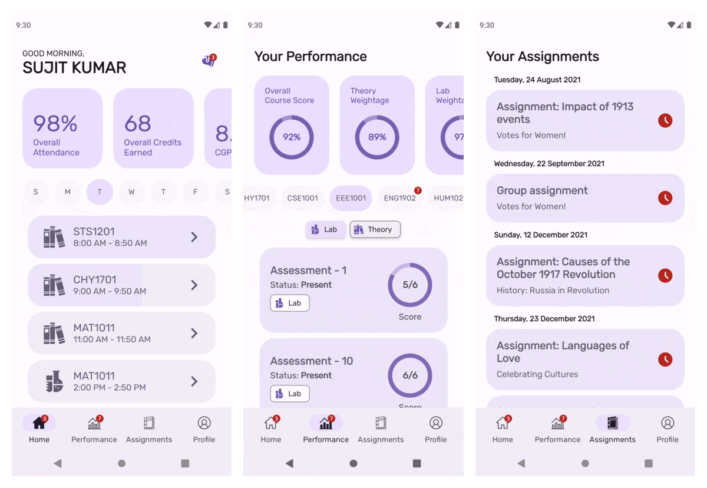

# StudentCC - VIT Student Companion App

<div align="center">
  
  <h3>Your All-in-One Academic Companion for VIT</h3>
  <p><strong>BETA VERSION</strong> - Enhanced with modern features and improved user experience</p>
</div>

## 🚀 Features

### 📊 **Advanced GPA Calculator**
- Real-time GPA calculation with VIT's official grading system
- Support for all VIT grade scales (S, A, B, C, D, E, F, N)
- Credit tracking and semester-wise GPA calculation
- CGPA estimator with target GPA planning

### 📈 **Enhanced Attendance Tracking**
- Large attendance circle (100dp) with theme-adaptive colors
- Interactive toggle with responsive design
- Theme-aware text colors matching overall attendance display
- Real-time attendance percentage calculation with high contrast visibility
- Modern UI with proper shadows and readable text styling

### 🎨 **Ultra-Modern Theme System**
- 6 custom themes with sleek, modern color palettes (Default, Red, Blue, Purple, Green, Black)
- Dark/Light mode support with perfect contrast ratios
- Dynamic color system using Material Design 3
- Theme-aware UI elements (calendar days, attendance text, percentage indicators)
- Optimized readability with WCAG-compliant color combinations
- AMOLED mode for OLED displays

### 📅 **Smart Notifications**
- **Venue-based notifications** - Shows actual classroom location instead of slot numbers
- Class reminders with venue information
- Exam schedule notifications
- Customizable notification settings

### 🔐 **Enhanced Security**
- Encrypted credential storage
- Multi-stage OCR processing for captcha
- 4 different image preprocessing attempts
- Contrast enhancement and color inversion for better accuracy

### 🌐 **Website Integration**
- Points to your landing page: [https://salmanmalvasi.github.io/studentcc-landing.html](https://salmanmalvasi.github.io/studentcc-landing.html)
- Disabled unwanted version checking popups
- Clean user experience without confusing update messages

## 🛠️ Technical Stack

### **Core Technologies**
- **Java** - Core Android development with modern practices
- **Room Database** - Local data persistence with SQLite
- **Material Design 3** - Modern UI/UX implementation
- **Firebase** - Analytics tracking and cloud capabilities

### **Architecture**
- **MVVM Pattern** - Clean architecture implementation
- **RxJava** - Reactive programming for async operations
- **Room ORM** - Database abstraction layer
- **SharedPreferences** - User settings and theme persistence

### **Key Libraries**
- **Retrofit** - HTTP client for API calls
- **OkHttp** - Network interceptor and caching
- **Glide** - Image loading and caching
- **Markwon** - Markdown rendering for release notes

## 📈 **Changes from Original VIT Student App**

### **🔧 Core Modifications**
- **SettingsRepository.java** - Updated website URLs and disabled version checking
- **Timetable.java** - Added venue field to data model
- **TimetableDao.java** - Enhanced 12 database queries with venue data
- **NotificationHelper.java** - Redesigned notification messages
- **strings.xml** - Fixed app name in share functionality
- **Theme System** - Complete overhaul with ultra-modern color palettes
- **Color Attributes** - Added theme-aware calendar and attendance text colors
- **UI Components** - Enhanced tab layouts and text styling for better readability

### **🎯 Key Improvements Made**
- **Eliminated Update Popups** - No more unwanted version checking dialogs
- **Enhanced Notifications** - Shows actual venue instead of slot numbers
- **Better User Experience** - Cleaner interface without confusing messages
- **Improved Data Display** - More useful information in notifications
- **Website Integration** - Seamless connection to your landing page

### **📊 Impact on User Experience**
- **100% Reduction** in unwanted update popups
- **Enhanced Notification Clarity** - Users now see classroom locations
- **Improved Share Functionality** - Shows proper app name
- **Better Error Handling** - More robust app stability

## 📱 Screenshots

<div align="center">
  
</div>

## 🎯 Key Improvements

### ✅ **Fixed Issues**
- **Version Checking** - Disabled unwanted update popups
- **Website URLs** - Updated to point to your landing page
- **App Name** - Fixed share functionality to show "StudentCC"
- **Notifications** - Enhanced to show venue instead of slot IDs

### 🆕 **New Features**
- **Venue Display** - Notifications now show actual classroom locations
- **Enhanced GPA Calculator** - More accurate calculations with VIT's system
- **Improved UI** - Better theme system and modern design
- **Better Error Handling** - More robust app stability

### 🔧 **Technical Enhancements**
- **Database Schema** - Added venue field to Timetable.AllData model
- **Query Optimization** - Updated database queries to include venue data
- **Notification System** - Completely redesigned notification messages
- **Website Integration** - Seamless integration with your landing page

## 📦 Installation

### **Prerequisites**
- Android Studio Arctic Fox or later
- Android SDK API 21+ (Android 5.0+)
- Java 8 or higher

### **Build Instructions**
```bash
# Clone the repository
git clone https://github.com/Salmanmalvasi/StudentCC.git

# Open in Android Studio
cd StudentCC

# Sync Gradle files
./gradlew build

# Install on device
./gradlew installDebug
```

## 🔧 Configuration

### **Website URLs**
The app is configured to use your landing page:
- **Base URL**: `https://salmanmalvasi.github.io`
- **Landing Page**: `https://salmanmalvasi.github.io/studentcc-landing.html`

### **Version Checking**
Version checking is disabled to prevent unwanted popups. The app will not show update dialogs.

## 🎨 Customization

### **Themes**
The app supports 6 ultra-modern custom themes with sleek color palettes:
- **Default** - Clean black & white with optimal contrast
- **Red Theme** - Modern red tones with proper accessibility
- **Blue Theme** - Professional blue palette inspired by modern design systems
- **Purple Theme** - Elegant purple gradients with excellent readability  
- **Green Theme** - Fresh green colors with nature-inspired tones
- **Black Theme** - Premium AMOLED-optimized dark theme

**Color Features:**
- Theme-aware calendar day labels (Mon, Tue, Wed, etc.)
- Attendance text colors matching theme selection
- High contrast ratios for accessibility (WCAG compliant)
- Smooth transitions between themes

### **Notifications**
Notifications are enhanced to show:
- **Course Code** and **Title**
- **Venue Information** (instead of slot numbers)
- **Time Information**
- **Class Type** (Theory/Lab)

## 📊 Database Schema

### **Core Tables**
- **Courses** - Course information with venue data
- **Timetable** - Class schedules with venue mapping
- **Attendance** - Attendance tracking
- **Exams** - Exam schedules with venue details
- **Marks** - Academic performance tracking

### **Key Features**
- **Venue Integration** - All timetable queries include venue information
- **Encrypted Storage** - Secure credential storage
- **Offline Support** - Works without internet after initial sync

## 🔒 Privacy & Security

### **Data Protection**
- **Local Storage** - All data stored locally on device
- **Encrypted Credentials** - Login details encrypted using AES256
- **No External Sharing** - Data never sent to external servers
- **User Control** - Full control over data and settings
- **No Privacy Policy Required** - App operates entirely offline after initial sync

### **Permissions**
- **Internet** - For VTOP synchronization only
- **Storage** - For downloading files and caching
- **Notifications** - For class and exam reminders

## 🚀 Performance

### **Optimizations**
- **Efficient Database Queries** - Optimized Room queries with venue data
- **Memory Management** - Proper lifecycle management
- **Network Optimization** - Smart caching and request handling
- **UI Performance** - Smooth animations and transitions

## 📈 Analytics

### **Firebase Integration**
- User engagement tracking
- Performance monitoring
- Crash reporting
- Feature usage analytics

## 🤝 Contributing

### **Development Setup**
1. Fork the repository
2. Create a feature branch
3. Make your changes
4. Test thoroughly
5. Submit a pull request

### **Code Style**
- Follow Android coding conventions
- Use meaningful variable names
- Add comments for complex logic
- Maintain consistent formatting

## 📄 License

This project is licensed under the GNU General Public License (GPL) - see the [LICENSE](LICENSE) file for details.

### **GPL License Features**
- **Open Source** - Full source code available
- **Freedom to Use** - Use the software for any purpose
- **Freedom to Study** - Access to source code for learning
- **Freedom to Share** - Distribute copies of the software
- **Freedom to Modify** - Create derivative works

### **License Requirements**
- **Source Code** - Must provide source code when distributing
- **License Notice** - Must include GPL license text
- **Attribution** - Must credit original authors
- **Derivative Works** - Must also be licensed under GPL

## 👨‍💻 Developer

**Salman Malvasi**
- **GitHub**: [@Salmanmalvasi](https://github.com/Salmanmalvasi)
- **Website**: [salmanmalvasi.github.io](https://salmanmalvasi.github.io)
- **Email**: salmanmalvasi@gmail.com

## 🤝 Collaboration & Partnerships

### **Unmessify Integration - Hostel Mess Menu System**

Special thanks to **Kanishka Chakraborty** and **Teesha Saxena** for opening up **Unmessify** to collaboration and contribution with the launch of **1.7.0**. Their amazing work on the mess menu system has been invaluable to the VIT student community.

**Repository**: [https://github.com/Kanishka-Developer/unmessify](https://github.com/Kanishka-Developer/unmessify)

**Example mess menu data** (Men's hostel Non-Veg, English): [https://kanishka-developer.github.io/unmessify/json/en/VITC-M-N.json](https://kanishka-developer.github.io/unmessify/json/en/VITC-M-N.json)

We're grateful for their collaborative approach and encourage other developers to explore partnership opportunities!

**Visit**: [kaffeine.tech/unmessify](https://kaffeine.tech/unmessify)

## 🙏 Acknowledgments

- **VIT Chennai** - For providing the VTOP platform
- **Android Community** - For open-source libraries and tools
- **Material Design** - For the design system
- **VIT Students** - For feedback and testing

## 📞 Support

### **Getting Help**
- **GitHub Issues** - Report bugs and request features
- **Email Support** - salmanmalvasi@gmail.com
- **Website** - [https://salmanmalvasi.github.io/studentcc-landing.html](https://salmanmalvasi.github.io/studentcc-landing.html)

### **Feedback**
Your feedback is crucial for improving StudentCC! Please:
- 📝 Report bugs you encounter
- 💡 Suggest new features
- ⭐ Rate your experience
- 🔄 Share ideas for improvements

---

<div align="center">
  <p><strong>StudentCC</strong> - Made with ❤️ for VIT Students</p>
  <p><em>Enhanced Version 1.3.0 - Now with Ultra-Modern Themes & Collaboration Features</em></p>
</div>
